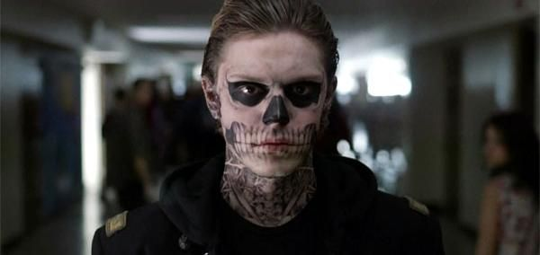

<html>
  <head>
    <meta charset="utf-8">
    <link rel="stylesheet" type="text/css" href="htmll.css">
  </head>
  <body>
        <h1>American horror story</h1>
        
 Az Amerikai Horror Story (American Horror Story) egy amerikai horror-dráma sorozat, amit Ryan Murphy és Brad Falchuk készített. A sorozat antológia jellegű, hiszen minden évad egy, az előzőtől független történetet mesél el, egyfajta minisorozatként kezelendő. Murphy szerint mindegyiknek van kezdete, közepe és vége. Az egyes évadok számos elemei igaz történeteken alapulnak. A sorozat ugyan antológia jellegű, azonban egyes karakterek feltűnnek több évadban is.

        
         <h2>Első évad-<i>A gyilkos ház</i></h2>
         <a href="gykh.html">
          

</body>
</html>
